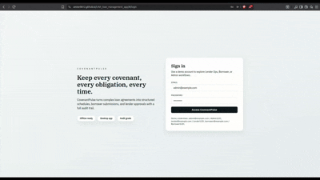

# CovenantPulse - Loan Covenant and Obligation Compliance WEB/Desktop App

CovenantPulse turns complex loan agreements into structured obligations, covenant calculations, borrower submissions, lender review workflows, alerts, audit trails, and exportable reporting - all offline in a desktop app.
## Demo
https://amine9812.github.io/LMA_loan_management_app/


## Highlights
- Loan workspace creation, document ingestion, clause tagging, and obligation scheduling
- Covenant engine with real ratio calculations (Leverage + Interest Coverage)
- Borrower submission wizard with draft/submit flow, financial inputs, and evidence attachments
- Lender review queue with submission detail, covenant results, and approval notes
- Waiver requests with attachments, conditions, and expiry tracking
- Audit timeline per loan and CSV/PDF/JSON export packs + export history
- Document-to-Data Workbench with offline extraction suggestions and provenance
- Term Sheet versioning, clause template library, draft generation, and semantic diff
- Consistency checker for threshold, due date, and definition drift
- Loan Obligation Schema JSON import/export for interoperability
- Green Loan Assessment module with explainable scoring and evidence tags
- Help & User Guide section for every workflow
- Prototype Mode for clickable demo flows

## Tech Stack
- Electron + React + TypeScript
- TailwindCSS for UI
- SQLite via better-sqlite3 with SQL migrations
- React Query + Zod validation
- Vitest + Playwright

## Setup
```bash
npm install
```

## Run (dev)
```bash
npm run dev
```

## Build
```bash
npm run build
```

## Package (electron-builder)
```bash
npm run package
```

## Test
```bash
npm run test
```

## Demo Credentials
- admin@example.com / Admin123!
- lender@example.com / Lender123!
- borrower@example.com / Borrower123!

## First 5 Minutes (Quick Start)
1) Go to `Loans` -> click `New Loan` -> fill fields -> `Save Loan`.
2) Select the loan in the sidebar `Current Loan` dropdown.
3) Go to `Documents` -> `Upload PDF` -> choose a file.
4) Go to `Obligations` -> `Create Obligation` -> save.
5) Go to `Covenants` -> `Create Covenant` -> save.
6) Go to `Green Lending Check` -> fill inputs -> `Run Assessment`.
7) Go to `Submissions` -> `New Submission` -> enter metrics -> `Submit`.
8) Go to `Review Queue` -> approve/reject.
9) Go to `Exports` -> export PDF compliance pack.

If you see counts on the Dashboard widgets, you are set.

## Definitions (Quick Glossary)
- Covenant: A financial test (e.g., Leverage Ratio <= 3.5x).
- Obligation: A deliverable due by a date (e.g., quarterly financials due 45 days after quarter end).
- Breach: A covenant test fails against its threshold.
- Submission: Borrower package of inputs + evidence for a period.
- Waiver: Lender-approved temporary exception to a breach or late obligation.
- Compliance Pack: PDF export with obligations, covenants, waivers, and green summary.
- Green Lending Check: Scored assessment with Green/Transitional/Not Green verdict.

## Troubleshooting
- Created a loan but can’t see it: refresh the Loans page and check filters.
- Dashboard is empty: add obligations and generate schedule instances.
- Green tab missing: select a loan and open `Green Lending Check` from Loan Detail tabs.
- Exports not downloading: choose a folder in the save dialog and retry.

## 3-Minute Demo Script
See `DEMO_SCRIPT.md` for a step-by-step walkthrough.

## Data Storage
The app stores data locally under the Electron user data directory:
- SQLite DB: `.../covenantpulse/covenantpulse.sqlite`
- Documents: `.../covenantpulse/documents`
- Attachments: `.../covenantpulse/attachments`
- Exports: `.../covenantpulse/exports`

## Integrations Layer
A mock adapter is implemented at `apps/desktop-electron/src/main/integrations.ts`. It provides a clean interface and a placeholder for hackathon SDK/API integration.
Document extraction adapters live at `apps/desktop-electron/src/main/documentExtraction.ts` with local heuristic and mock implementations.

## Interoperability Schema
Loan Obligation Schema JSON v0.1 is defined at `packages/shared/interoperability/loan-obligation-schema-v0.1.json`.

## Prototype Mode
Open `Prototype Mode` in the left navigation or go to `/#/prototype` in the renderer to view clickable, seeded flows.

## Notes
- The first run seeds two sample loans with obligations, covenants, sample documents, and a sample submission.
- Offline-first by design.
